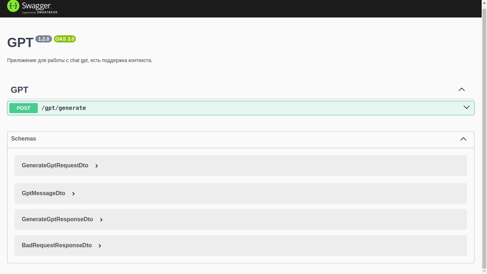
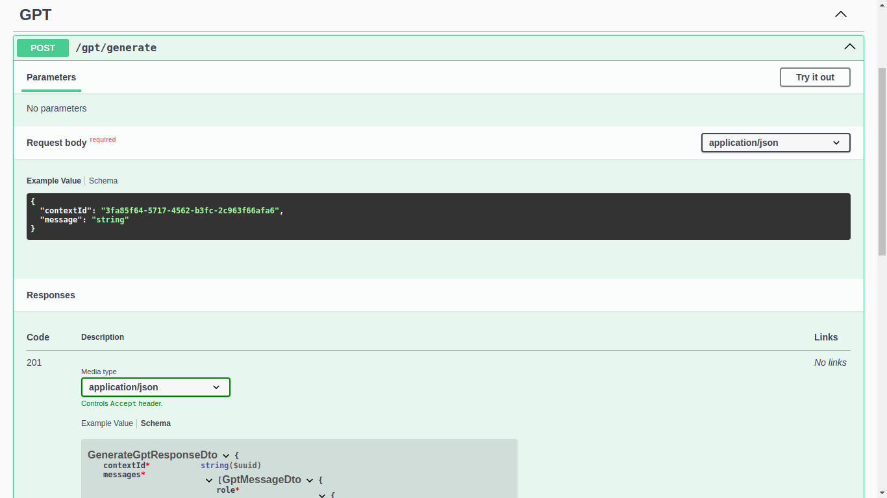
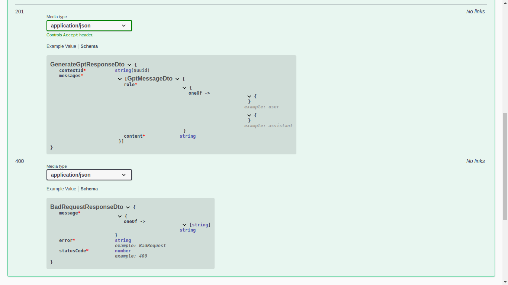
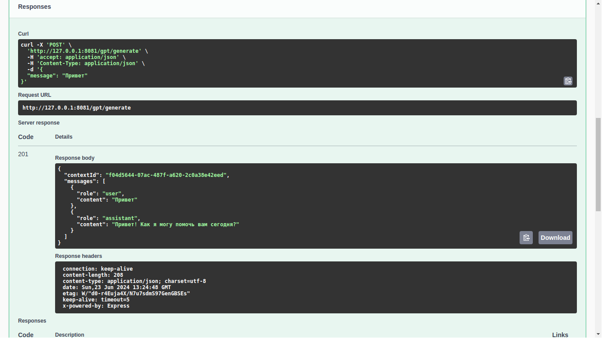
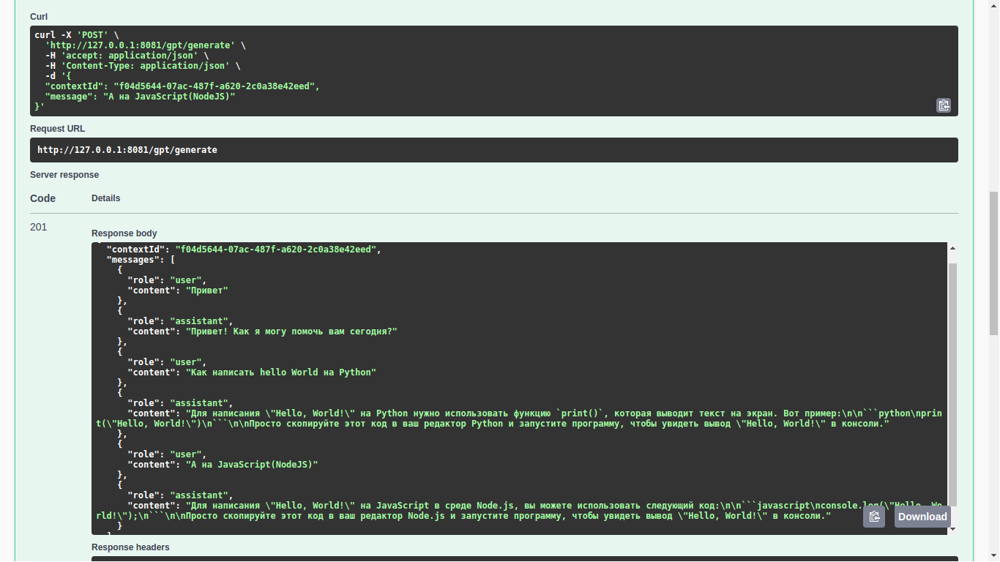

# Backend Practice

Это репозиторий в котором, я показываю навыки в сфере `Backend` на JavaScript(TypeScript), применяя лучшие практики и соблюдая принципам `SOLID`

## Как устроен репозиторий?

Репозиторий устроен так, чтобы переход между проектами была намного проще.
Чтобы перейти по другим моим проектам вы можете перейти на другую ветку, а не в другой репозиторий

## Как запускать проекты?

Во всех моих проектах присутствует Docker, Docker Compose.
И поэтому запуск выглядит так:

```sh
docker compose up
```

Запуск в фоновом режиме:

```sh
docker compose up -d
```

и открываете [ссылку](http://localhost:8081/docs)

## Текущий проект

Простое взаимодействие с `chatgpt` через g4f (`gpt4free`), с сохранением контекста

## Стэк технологий:

- NestJS
  - Swagger
  - Валидация
- Docker
  - Docker Compose
  - Docker Ignore
- ChatGPT
  - g4f

### Демо:






